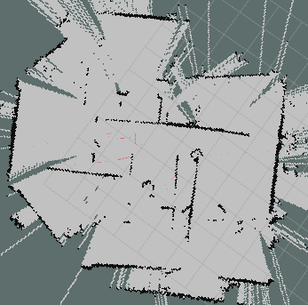
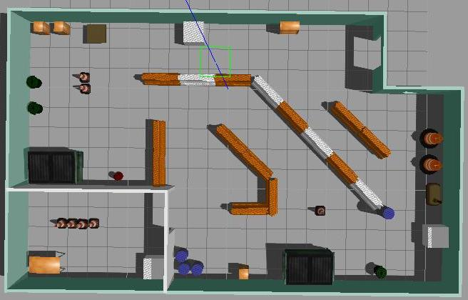
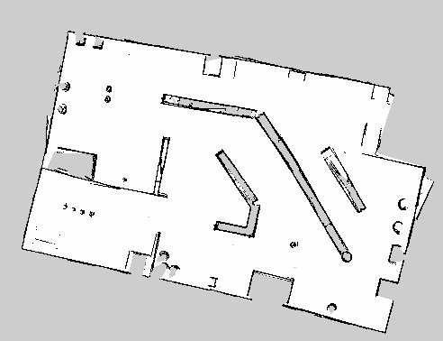
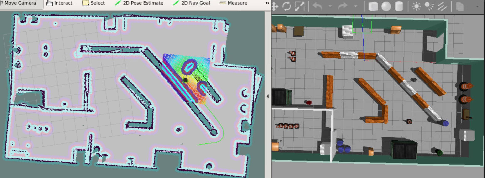
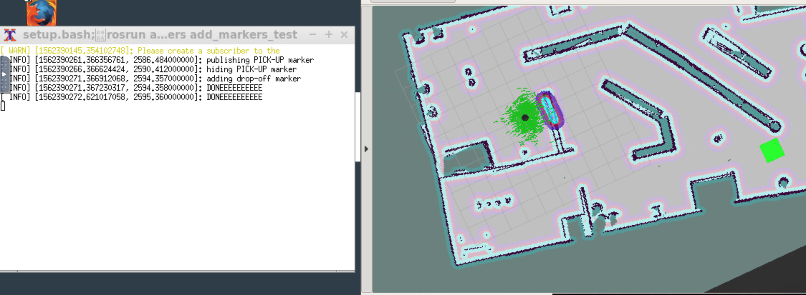

# Home Service Robot

Final project for Udacity's Robotics Software Engineer Nanodegree Program

<p align="center"></p>


**Project Goals**

The goal of this project was to design a robot's environment in gazebo and program the home-service robot that will map it's environment and autonomously navigate to pre-specified pickup and drop-off locations. For this one needed to:

* Design robot's environment with the Building Editor in Gazebo.
* Teleoperate the robot and manually test SLAM.
* Use the ROS navigation stack and manually command the robot using the 2D Nav Goal arrow in rviz to move to 2 different desired positions and orientations.
* Write a pick_objects node that commands the robot to move to the desired pickup and drop off zones.
* Write an add_markers node that subscribes to the robot odometry and publishes pick-up and drop-off markers to rviz.
* modify pick_objects node and add_markers node to establish communication between them, to complete desired home service robot implementation

### Prerequisites
(since I have not tested on multiple platforms, and versions, I am listing only the configuration I used)

* Ubuntu 16.04 OS with default make (>=4.1) and g++/gcc (>=5.4) packages
* Gazebo >= 7.0
* ROS Kinetic
* following ROS packages were used and the process of obtaining them is detailed below:
	* [gmapping](http://wiki.ros.org/gmapping)
	* [turtlebot_teleop](http://wiki.ros.org/turtlebot_teleop)
	* [turtlebot_rviz_launchers](http://wiki.ros.org/turtlebot_rviz_launchers)
	* [turtlebot_gazebo](http://wiki.ros.org/turtlebot_gazebo)

### Directory Tree and contents

```
.
├── README.md
├── images
│   ├── ... ...
├── CMakeLists.txt
├── add_markers
│   ├── launch
│   │   └── home_service_rviz_config.launch
│   └── src
│       ├── add_markers.cpp
│       └── add_markers_test.cpp
│   ├──  ... ...
├── config
│   └── marker_config.yaml
├── map
│   ├── building
│   │   ├── ... ...
│   ├── home_service.world
│   ├── home_service_map.pgm
│   ├── home_service_map.yaml
├── pick_objects
│   └── src
│       ├── pick_objects.cpp
│       └── pick_objects_test.cpp
│   ├──  ... ...
├── rvizConfig
│   └── home_service.rviz
├── scripts
│   ├── add_marker.sh
│   ├── home_service.sh
│   ├── pick_objects.sh
│   ├── test_navigation.sh
│   └── test_slam.sh
├── slam_gmapping
│   ├── gmapping
│   |── ... ...
├── turtlebot
│   |── turtlebot_teleop
│   |── ... ...
├── turtlebot_interactions
│   |── turtlebot_rviz_launchers
│   |── ... ...
|── turtlebot_simulator
│   ├── turtlebot_gazebo
│   |── ... ...

```

This directory represents the main project's `src` folder structure with following contents

* README.md: this file.
* **images** - folder with images and videos for this report
* **add_markers** - add marker C++ node
* **config** - folder with configuration file to specify pick-up and drop-off locations
* **map** - map and gazebo world files
* **pick_objects** - pick-objects C++ node
* **rvizConfig** - folder with rViz configurations used with some launch scripts
* **scripts** - shell scripts
	* `add_marker.sh` - script for testing add_marker concept with `add_markers_test.cpp`
	* `home_service.sh` - main script for the home-service-robot
	* `pick_objects.sh` - script for testing pick_objects concept with `pick_objects_test`
	* `test_navigation.sh` - script for testing navigation
	* `test_slam.sh` - script for performing SLAM and preparing map
* **slam_gmapping** - official ROS package with `gmapping_demo.launch` file
* **turtlebot** - official ROS package with `keyboard_teleop.launch` file
* **turtlebot_interactions** - official ROS package with `view_navigation.launch` file
* **turtlebot_simulator** - official ROS package with `turtlebot_world.launch` file

---

### Clone and Build

Since the folder presented here comprises only of ROS package, one needs to first create a catkin workspace and initialize it. Also, note that the official ROS packaged are already included here, but their dependencies need to be installed; steps for this are given below.

Within your `home` directory, execute the following:

```
mkdir -p catkin_ws/src
cd catkin_ws/src
catkin_init_workspace
```

Within `~/catkin_ws/src/` download or clone folders of this repository:

```
cd ~/catkin_ws/src/
git clone https://github.com/viks8dm/home-service-robot.git
```

Install dependencies:

```
rosdep -i install gmapping -y
rosdep -i install turtlebot_teleop -y
rosdep -i install turtlebot_rviz_launchers -y
rosdep -i install turtlebot_gazebo -y
```

`NOTE`: If any of the official packages give error, I recommed you delete associated folder and clone with src folder using appropriate line from here:

```
git clone https://github.com/ros-perception/slam_gmapping.git  
git clone https://github.com/turtlebot/turtlebot.git  
git clone https://github.com/turtlebot/turtlebot_interactions.git  
git clone https://github.com/turtlebot/turtlebot_simulator.git
```

Go back to catkin workspace and build it

```
cd ~/catkin_ws/
catkin_make
```

### Launch specific application and visualize

Specific applications can be launched using scripts provided. In this section I will go over how I have used these scripts.

##### Gazebo-world, SLAM test & map-creation

For my world file I started with the gazebo-world I have used in past (like the one in https://github.com/viks8dm/mapping_ROS). However, during SLAM and map preparation I realized that this world had following flaws:

* it has very few features and a lot of open space. This leads to `gmapping` error with following messages:
	* `Scan Matching Failed, using odometry. Likelihood=0`
* There were two carts in the model which were not fixed. So while the robot completed a loop and came back to a spot near one of the carts, the mapping algorithm was getting confused and resulting in image rotation in rviz, similar to that shown below.




*Fig.1: gmapping-error sample*

Hence I added features to the world and updated it to that shown here:


*Fig.2: home-service-world*

For SLAM-test go to `src/scripts` folder and run `test_slam.sh` script:

```
cd ~/catkin_ws/src/scripts
./test_slam.sh
```

This will launch:

* `turtlebot_world.launch` to deploy turtlebot in my world with specific pose
* `gmapping_demo.launch` to perform SLAM
* `view_navigation.launch` to observe map in rviz
* `keyboard_teleop.launch` to manually control robot

After navigating the robot around multiple times, once I was satisfied with the map appearance in comparison to the world-file, I saved it using:

`rosrun map_server map_saver -f <map-location-and-name>`

The corresponding map looks as follows:


*Fig.3: saved-map*

##### Localization and navigation test

For localization testing, I used `test_localization.sh` as follows:

```
cd ~/catkin_ws/src/scripts
./test_localization.sh
```

This will launch:

* `turtlebot_world.launch` to deploy turtlebot in my world with specific pose
* `amcl_demo.launch` to localize turtlebot
* `view_navigation.launch` to observe map in rviz

I used `2D Nav` tab in rviz to manually point out to two different goals, one at a time, and direct the robot to reach them and orient itself with respect to them. A sample image is shown below and the sample video can be found [here](https://youtu.be/DN2bRCeoVyI)


*Fig.4: navigation-test sample*

##### Navigation Goal Node (pick-objects)

To test robot's capability to reach multiple goals, as specified by the program (and not manually), I created pick_objects package and specifically `pick_objects_test.cpp` function. This can be tested following script which launches turtlebot, AMCL, rviz and pick_objects node:

```
cd ~/catkin_ws/src/scripts
./pick_objects.sh
```

##### Virtual Objects Node (add-markers)

To model a virtual object with markers in rviz, I created add_markers package and specifically `add_markers_test.cpp` function. This can be tested following script which launches turtlebot, AMCL, rviz and add_markers node:

```
cd ~/catkin_ws/src/scripts
./add_markers.sh
```
A sampe output is shown here:


*Fig.5: virtual object addition test*


##### Home-Service-Robot package

To simulate a full home service robot capable of navigating to pick up and deliver virtual objects, communication was established between the add_markers and pick_objects nodes via a `"/goal_reached"` topic. For this purpose modified versions of previous test codes were created respectively `pick_objects.cpp` and `add_markers.cpp`. The entire package can be launched using:

```
cd ~/catkin_ws/src/scripts
./home_service.sh
```

The result can be seen in the gif display above or at one of these video links:

* home-service-robot's rviz window: https://youtu.be/iy3RJXRyFkw
* home-service-robot's rviz with messages: https://youtu.be/mAXX1b7Ap_k
